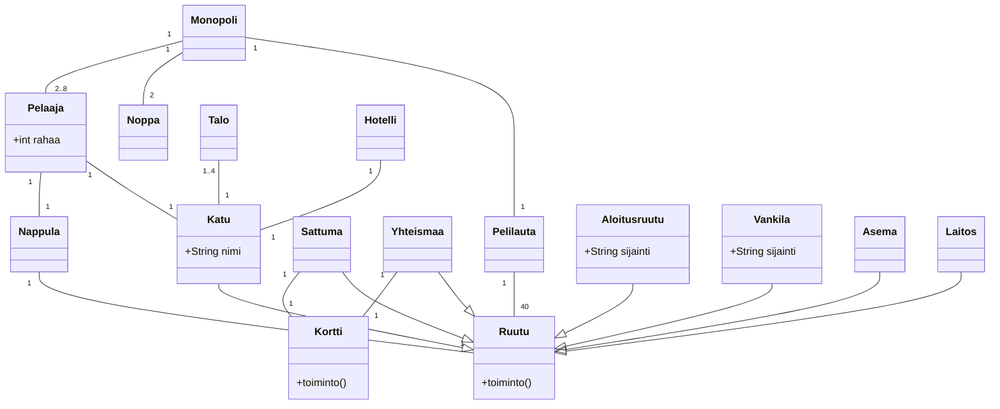

```mermaid
 classDiagram
      Monopoli "1" -- "2..8" Pelaaja
      Monopoli "1" -- "2" Noppa
      Monopoli "1" -- "1" Pelilauta
      Pelilauta "1" -- "40" Ruutu
      Pelaaja "1" -- "1" Nappula
      Nappula "1" -- "1" Ruutu
      Sattuma "1" -- "1" Kortti
      Yhteismaa "1" -- "1" Kortti
      Pelaaja "1" -- "1" Katu
      Talo "1..4" -- "1" Katu
      Hotelli "1" -- "1" Katu
      Aloitusruutu --|> Ruutu
      Vankila --|> Ruutu
      Sattuma --|> Ruutu
      Yhteismaa --|> Ruutu
      Asema --|> Ruutu
      Laitos --|> Ruutu
      Katu --|> Ruutu
      class Monopoli{
      }
      class Pelaaja{
      +int rahaa
      }
      class Noppa{
      }
      class Pelilauta{
      }
      class Ruutu{
      +toiminto()
      }
      class Nappula{
      }
      class Aloitusruutu{
      +String sijainti
      }
      class Vankila{
      +String sijainti
      }
      class Sattuma{
      }
      class Asema{
      }
      class Yhteismaa{
      }
      class Laitos{
      }
      class Katu{
      +String nimi
      }
      class Kortti{
      +toiminto()
      }
      class Talo{
      }
      class Hotelli{
      }
```
